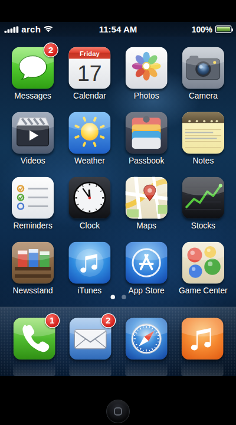
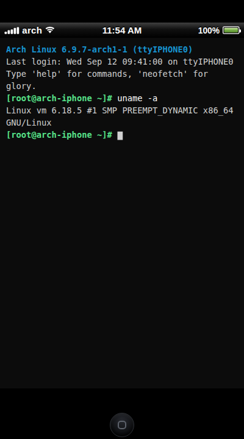
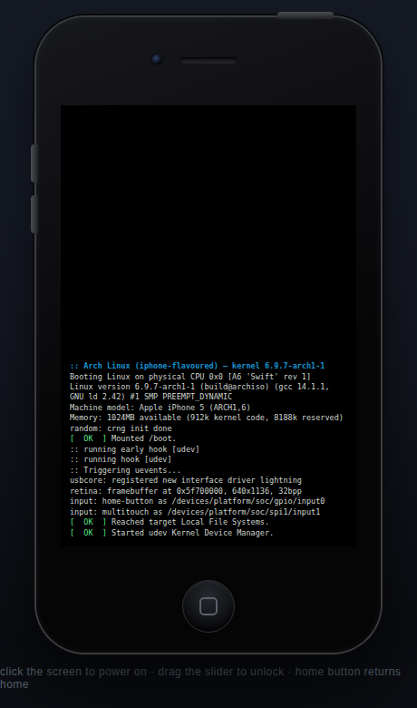
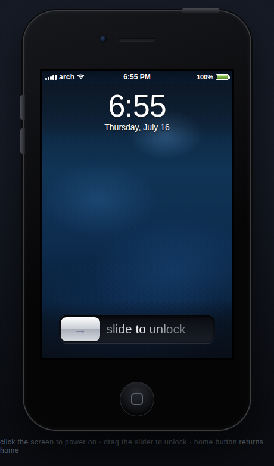
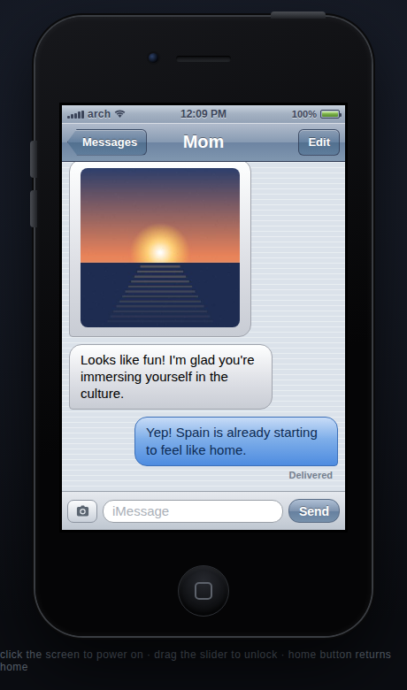
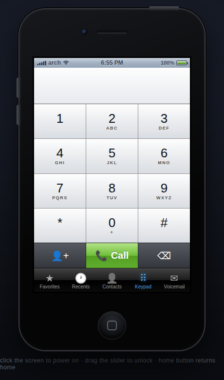
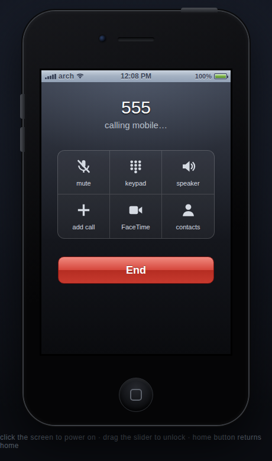
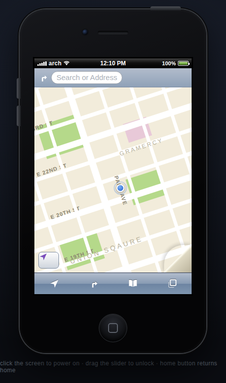
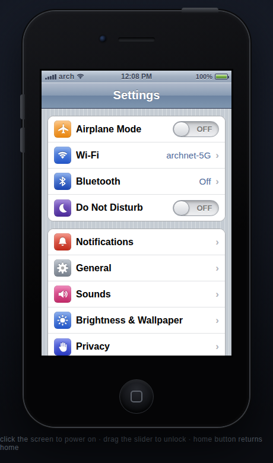
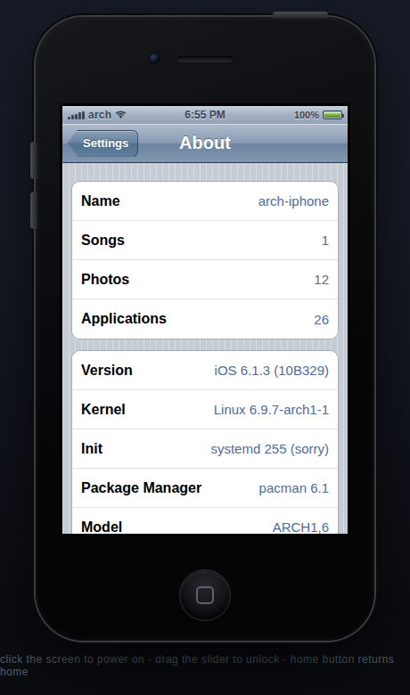

# iOS 6 · Arch Edition

**iOS 6, rebuilt on top of Arch Linux.** The Arch kernel boots, systemd comes
up, and instead of a login prompt the machine hands you the classic
*slide to unlock* screen. The iOS 6 SpringBoard — every stock app, telephony,
iMessage-style Messages — runs as the system shell, fullscreen, wired to the
real hardware underneath: real kernel and hostname in Settings → About, real
battery from `/sys`, real Wi-Fi from NetworkManager, and real voice calls and
SMS through ModemManager on hardware that has a modem.

| The shell (fullscreen kiosk) | Real kernel through the Terminal |
|---|---|
|  |  |

The screenshot on the right is not staged: `uname -a` inside the Terminal app
reports the actual running kernel, fetched live from the `ios6d` system bridge.

## Architecture

```
┌─────────────────────────────────────────────────┐
│  SpringBoard (the iOS 6 UI)                     │  pure HTML/CSS/JS,
│  Messages · Phone · Maps · Settings · 26 apps   │  no frameworks/assets
├────────────────────────┬────────────────────────┤
│  chromium --kiosk      │  ios6d (python stdlib) │  the UI polls ios6d on
│  under cage (Wayland)  │  127.0.0.1:9641        │  127.0.0.1 for real state
├────────────────────────┴────────────────────────┤
│  systemd · NetworkManager · ModemManager        │  Wi-Fi, calls, SMS
├─────────────────────────────────────────────────┤
│  Arch Linux kernel                              │  the actual one
└─────────────────────────────────────────────────┘
```

`ios6d` is a loopback-only bridge with a fixed whitelist: system probes
(`uname`, `/sys/class/power_supply`, `nmcli`, `mmcli -L`) plus two actions —
place a voice call and send an SMS via ModemManager, both with strict number
validation. When the daemon isn't running, the shell falls back to full
simulation automatically.

## Three ways to run it

### 1 · Bootable ISO (the full experience)

On any Arch system with [`archiso`](https://wiki.archlinux.org/title/Archiso):

```sh
sudo pacman -S archiso
sudo os/archiso/build-iso.sh            # ~6 GB workdir, takes a while
qemu-system-x86_64 -m 3G -enable-kvm -cdrom /tmp/ios6-archiso/out/archlinux-*.iso
```

The profile derives from archiso's official `releng` profile (the one that
builds the real monthly Arch ISO): you'll watch the genuine Arch kernel boot,
then tty1 autologin execs `ios6-shell` — cage + Chromium in kiosk mode — and
the machine *is* an iPhone from 2012. NetworkManager, ModemManager and
`ios6d` are enabled as services.

### 1b · Run it in UTM (macOS)

CI builds two ready-to-run artifacts on every push touching `os/**`
(Actions → *Build & boot-test the iOS 6 Arch ISO* → latest run → Artifacts):

**Apple Silicon (M1–M4) — native speed.** Download `ios6-arch-utm-aarch64`
(unzip → `ios6-arch-aarch64.qcow2`, genuine Arch Linux ARM with UEFI/
systemd-boot). In UTM:

1. *Create a New VM → Virtualize → Linux* — leave the boot ISO empty and
   finish the wizard with defaults.
2. Open the VM's settings → **Drives**: delete the empty disk the wizard
   created, then *New… → Import* and pick the `.qcow2` (interface: VirtIO).
3. System: 4 GB RAM, 4 cores. Display: `virtio-gpu-pci` (the default).
4. Start. UEFI finds systemd-boot, the Arch ARM kernel boots, tty1
   autologins and the machine becomes an iPhone. Login fallback:
   `root` / `ios6` on any other console.

**Intel Mac (or emulated x86_64 on Apple Silicon — slow).** Download
`ios6-arch-iso`, then *Create a New VM → Virtualize* (Intel) or *Emulate*
(Apple Silicon) *→ Linux → Boot ISO image* = the ISO. 3 GB RAM. The live
ISO boots straight into the shell.

The shell renders in software (`WLR_RENDERER=pixman`, no GPU needed), so
UTM's default display device just works.

### 2 · On an existing Arch install

```sh
cd os/pkg && makepkg -si                # installs ios6-shell, ios6d, units
sudo systemctl enable --now ios6d       # system bridge (battery/Wi-Fi/modem)
ios6-shell                              # from a TTY — or:
sudo systemctl enable ios6-shell        # boot straight into iOS 6
```

On a phone-shaped device running Arch Linux ARM with a ModemManager-managed
modem (PinePhone and friends), the Phone app's dialer places **real calls**
and green-bubble threads in Messages send **real SMS**. On a laptop you get
real Wi-Fi, battery and kernel info, with telephony simulated.

### 3 · Browser demo (no install)

```sh
python -m http.server 8000    # or just open index.html
```

Everything works in simulation mode: click the screen to power on, drag the
slider to unlock. Append `?kiosk=1` to preview the fullscreen shell layout.

## What's inside

**System** — Arch kernel boot log → Apple logo → slide-to-unlock (drag it for
real) → two-page springboard with dock, badges and swipe navigation. Live
status bar with per-app tinting, on-screen QWERTY keyboard (hardware keyboard
works too), iOS 6 alerts/action sheets/nav stacks/toggles, wallpaper picker,
a brightness slider that really dims the screen, sleep/wake.

**Telephoning** — Favorites / Recents / Contacts / Keypad / Voicemail, DTMF
tones, live contact lookup while dialing, full in-call screen. Calls go
through ModemManager when a modem is present, otherwise they're simulated —
either way they land in Recents.

**Messages** — blue iMessage vs green SMS bubbles per contact, photo bubbles,
"Delivered" receipts, typing indicator, contacts who text back. Real SMS via
ModemManager on modem hardware.

**App Store & Cydia** — the App Store actually installs apps: they appear
on the home screen, persist, open as working mini-apps (Chirper, a playable
Angry Penguins, RPN Calc, Wiki Reader, Flashlight), and are removed with a
long-press wiggle + ✕, like it's 2012. Cydia ships preinstalled (the device
is "jailbroken", it runs Arch after all) with tweaks that genuinely work —
custom carrier text, dark keyboard, verbose boot, felt wallpaper — and on
real hardware its Changes/Search tabs front **actual pacman** through
`ios6d`: live update lists, repo search, and real package installs
(loopback-only, validated names, disable by removing
`IOS6D_ALLOW_INSTALL=1` from ios6d.service).

**Every page exists** — Calendar (live month grid), Photos (generated camera
roll), Camera (shots save to the roll), Videos, Weather, Passbook, Notes and
Reminders (persistent), Clock (live world clocks, stopwatch, timer), Maps
(tilted street grid, pins, turn-by-turn banner), Stocks, Newsstand, iTunes,
App Store, Game Center, Settings (working airplane mode, Wi-Fi, wallpapers,
About with the real kernel), Contacts, Calculator, Compass (uses device
orientation), Voice Memos, Mail, Safari, Music (plays a generative chiptune)
— and a Terminal where `neofetch`, `uname -a` and `pacman -Syu` do the right
thing, against the real system when the bridge is up.

| Boot | Lock | iMessage | Phone | In-call | Maps | Settings | About |
|---|---|---|---|---|---|---|---|
|  |  |  |  |  |  |  |  |

All interface symbols — tab bars, toolbars, the in-call grid, Settings rows,
weather conditions, transport controls — are hand-drawn monochrome SVG glyphs
in the iOS 6 style (no emoji, no Apple asset files; Apple's original artwork
is copyrighted, so everything is redrawn from scratch).

## Repo layout

```
index.html, css/, js/       the SpringBoard shell (also runs standalone)
js/native.js                bridge client + kiosk fullscreen mode
os/bin/ios6d                system bridge daemon (python stdlib)
os/bin/ios6-shell           cage + chromium kiosk launcher
os/systemd/                 ios6d.service, ios6-shell.service
os/pkg/PKGBUILD             Arch package for existing installs
os/archiso/                 bootable ISO profile overlay + build-iso.sh
```

## Inspirations

- [The OldOS Project](https://github.com/zzanehip/the-oldos-project) — iOS 4
  rebuilt in SwiftUI, the spiritual ancestor
- [Arch Linux](https://gitlab.archlinux.org/archlinux) — the kernel, the
  attitude, the `btw`
- [iGTK theme](https://gitlab.com/Krafting/igtk-theme) — iOS-flavored
  theming on Linux

A loving fan recreation for educational purposes. Apple, iOS and iPhone are
trademarks of Apple Inc.; Arch Linux is a trademark of the Arch Linux
project. iMessage here is an aesthetic — Apple's actual iMessage network is
not, and cannot be, involved. No kernels were harmed; one was gently
repurposed.
