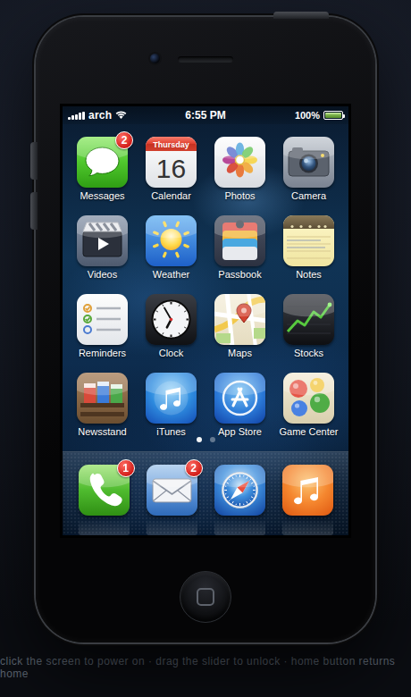
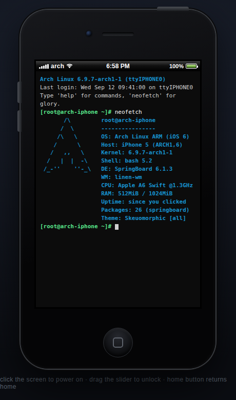

# iOS 6 · Arch Edition

A faithful, fully client-side recreation of **iOS 6** that boots on an
**Arch Linux kernel** — or at least as close as a browser tab can legally get.
Power it on and the machine runs an Arch-style kernel boot log
(`[  OK  ] Started Skeuomorphic Texture Daemon`), hands off to the Apple logo,
and drops you on the classic *slide to unlock* screen. Behind it: the full
iOS 6 home screen, every stock app present and opening to a real page, with
telephoning and iMessage front and center.

No frameworks, no build step, no network requests, no image assets — every
icon is inline SVG, every "photo" is generated on a canvas, every sound is
synthesized with WebAudio.

| Boot (Arch kernel) | Lock | Home | iMessage |
|---|---|---|---|
|  |  |  |  |

| Phone | Maps | Settings → About | Terminal |
|---|---|---|---|
|  |  |  |  |

## Run it

```sh
# any static server works; so does double-clicking index.html
python -m http.server 8000
# → http://localhost:8000
```

Click the screen to power on. Drag the slider to unlock. The round button
below the screen is the home button; the top-right edge button is sleep/wake.

## What works

**System**
- Arch Linux kernel boot log → Apple logo → lock screen
- Slide-to-unlock with the shimmering label, drag it for real
- Springboard with 2 pages (swipe between them), dock, badges, page dots
- Live status bar (clock, carrier `arch`, Wi-Fi, battery), per-app tinting
- Sleep/wake button, screen-off state, wake-to-lock
- On-screen QWERTY keyboard (tap keys) — your physical keyboard works too
- iOS 6-style alerts, action sheets, nav stacks, toggles, table views
- Wallpaper picker and a brightness slider that actually dims the screen

**Telephoning** — Phone app with Favorites / Recents / Contacts / Keypad /
Voicemail tabs, DTMF tones on the keypad, contact lookup while dialing, and a
full in-call screen (mute/speaker grid, call timer, End button). Calls land in
Recents.

**iMessage** — conversation list with unread dots, blue iMessage bubbles vs
green SMS per contact, photo bubbles, "Delivered" receipts, the typing-dots
indicator, and contacts who actually text back. Camera button attaches photos
from the camera roll.

**Every page exists** — Messages, Calendar (real month grid + events), Photos
(generated camera roll + viewer), Camera (animated viewfinder; shots save to
the roll), Videos, Weather, Passbook, Notes (persistent, on legal paper),
Reminders (persistent checklists), Clock (live world clocks, stopwatch, timer),
Maps (tilted street grid, pin drops, turn-by-turn banner), Stocks (live-ish
tickers + chart), Newsstand, iTunes, App Store, Game Center, Settings
(airplane mode, Wi-Fi, wallpapers, About page reporting the Linux kernel),
Contacts, Calculator (works), Compass (uses device orientation when
available), Voice Memos, Mail, Safari (browses a small curated internet),
Music (Now Playing that plays a generative chiptune) — plus a **Terminal**
where `neofetch`, `uname -a` and `pacman -Syu` do the right thing.

## About that kernel

A web page cannot ship a real kernel, so the Arch side is honored the way a
simulation can: the boot sequence, `Settings → General → About`
(`Linux 6.9.7-arch1-1`, `pacman 6.1`, model `ARCH1,6`), and the Terminal app
are all Arch through and through. If you want the real thing underneath,
serve this page from an actual Arch box — then the stack really is
iOS 6 on an Arch Linux kernel, with one thin browser-shaped layer in between.

## Layout

```
index.html              device shell & layers
css/system.css          device, status bar, lock, springboard, shared iOS 6 chrome
css/apps.css            per-app styles
js/data.js              contacts, threads, mail, photo generator, sound synth, prefs
js/icons.js             all home-screen icons as inline SVG
js/system.js            SpringBoard: app framework, keyboard, nav stacks, widgets
js/boot.js              the Arch boot sequence
js/apps/communication.js  Messages, Phone, Contacts, Mail
js/apps/productivity.js   Calendar, Notes, Reminders, Clock, Calculator,
                          Settings, Weather, Stocks, Maps
js/apps/media.js          Photos, Camera, Music, Safari, Videos, stores,
                          Game Center, Passbook, Newsstand, Voice Memos,
                          Compass, Terminal
```

## Inspirations

- [The OldOS Project](https://github.com/zzanehip/the-oldos-project) — the
  spiritual ancestor (iOS 4 in SwiftUI)
- [Arch Linux](https://gitlab.archlinux.org/archlinux) — the kernel, the
  attitude, the `btw`
- [iGTK theme](https://gitlab.com/Krafting/igtk-theme) — iOS-flavored theming
  on Linux

This is a loving fan recreation for educational purposes. Apple, iOS, iPhone
and the 2012 sense of optimism are trademarks of Apple Inc. Arch Linux is a
trademark of the Arch Linux project. No kernels were harmed.
